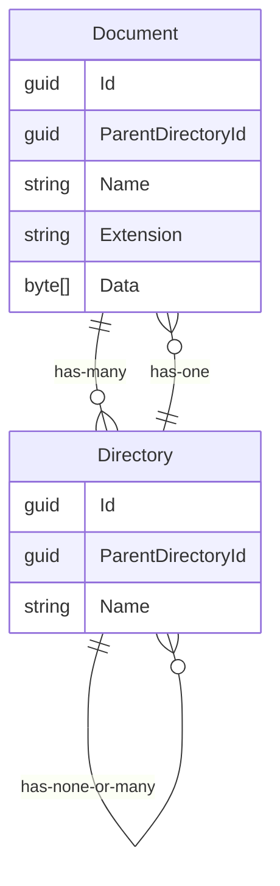

# eze-geo

A .Net Web Api and React SPA to manage and visualise .csv and .geojson datasets

## Development

### Requirements

- .Net Core 8.0
- Visual Studio 2022/Rider & VSCode or CLI
- NodeJs v20+ (16 or 18 may be fine )

### Getting Started

1. Back-end
   1. Build and Run the .Net Web Api located at `/src/backend/Api/Api.csproj` in debug mode
      1. Can be run with VisualStudio or Rider using the `https` launch profile
      2. Can be run from CLI running the npm script `api` from the /frontend folder or running `dotnet run --launch-profile https`
   2. Note: This will open swagger, ensure you `accept` the `developer certificate`
2. Front-end
   1. Navigate to `/src/frontend/` in the terminal
   2. Run `npm run setup` to install pnpm and the project packages
   3. Run `npm start` to run vite
   4. Note: API Models are generated using NSwagStudio, configuration file is available `nswagconfig.nswag`
3. Database
   1. Nothing needs to be done, the project should create a sqlite database automatically in the local user directory `C:\Users\{user}\AppData\Local`
   2. Delete the file and re-run the project to start clean

## Domain

### Goals

Develop a web-based file and folder explorer with the following features (use the wireframe below as the app’s UI layout).

- Display a file directory tree view to navigate within your file and folder system.
- Display a breadcrumb trail with links to parent or grandparent folders.
- Display a list of files and folders for selected folders.
- Create folders that can be named (‘rename’ functionality is not required).
- Select a local file and upload it to the file directory. Only csv or a geojson files can be uploaded (see example files).

### Assumptions

- A user can manage a web based folder structure.
- A folder can have a parent folder.
- A folder with no parent is considered a root directory.
- A folder can contain any number of files or folders

### Terms

- Directory - A Virtual directory with its overall structure determined by a parent id to another directory (no id means root directory)
- Document - An uploaded document with a record persisted to reference its parent directory

### Schema

### Current Limitations

- Directory Heirarchy is built using a single table using the entity `DocumentDirectoryNode`. To determine the folder structure you must traverse all nodes in the table, this is a time complexity issue for larger systems and should be refactored into a graph style dataset.
- Performance will be an issue on the frontend due to lack of response caching but this can be overcome with more work.

### Future Plans
- Add developer https certificate
- Add Unit Tests. `Back-end` and `Front-end`.
- Find a better blob storage (dont store in sql?)
- Add Login System using cookies
- Add Rename/Update/Delete capability for `Documents` and `Directories`
- Migrate from Sqlite to Postgres
- Investigate how to draw boundaries on a map using haversine formula and only recording longitudes and latitudes (geojson?)
- Fix Fluent validation for `CreateDocumentCommand`
- Fix Performance/Time Complexity of the `GetDirectoryStructureQuery`
- Add Pagination to `GetDocumentListQuery`
- Remove auto migrations from `Program.cs` and find a better approach
- Frontend: Improve UI (loading screens, table styling, request caching, display errors better using modal or toast messages)
- Frontend-Dev: Better layout of components and structure of the project, better naming, use more components
- Frontend: `FolderExplorerContext` getting messy and look into implementing cancellation tokens for api request